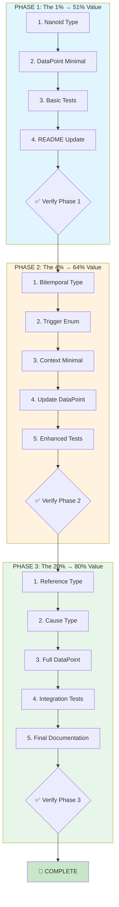

# DataPoint Implementation: Comprehensive Execution Plan

**Date:** 2026-02-12 23:11
**Status:** READY TO EXECUTE
**Goal:** Implement DataPoint[T] - the 1% that delivers 51% of the result FIRST

---

## PARETO ANALYSIS: What REALLY Matters

### The 1% That Delivers 51% of Result

**Minimal Viable DataPoint** - Store ANY data with WHO, WHEN, WHY:

```
DataPoint[T] {
    id       NanoId        // Unique identifier
    payload  T             // The actual data
    actor    ActorEntry    // WHO created it (already have this!)
    occurred Timestamp     // WHEN it happened
    recorded Timestamp     // WHEN we learned about it
    reason   string        // WHY it exists (simple, not full Cause)
}
```

**Why this delivers 51%:**

- ✅ Audit trail - know who did what when
- ✅ Accountability - every change attributed
- ✅ Basic temporal tracking - occurred vs recorded
- ✅ Human context - simple reason string
- ✅ Works with existing types (ActorEntry, Timestamp)
- ✅ Minimal API surface, easy to adopt
- ✅ Immediate value, no dependencies on other new types

**Already done:**

- `Id[T]` ✅
- `ActorEntry[T]` ✅
- `ActorChain[T]` ✅
- `Timestamp` ✅

**Need to implement:**

1. `NanoId` type
2. `DataPoint[T]` minimal version
3. Constructor functions
4. Basic tests

---

### The 4% That Delivers 64% of Result

**Enhanced DataPoint** - Add corrections and categorization:

```
+ Bitemporal {
    validFrom  Timestamp   // When it becomes valid
    validUntil *Timestamp  // When it stops being valid
}
+ Trigger enum              // Categorize WHY (UserAction, Scheduled, etc.)
+ Context minimal {
    correlation NanoId     // Cross-service trace
    service     string     // Originating service
}
```

**Why this delivers 64%:**

- ✅ Point-in-time queries ("what was valid on date X?")
- ✅ Backdated corrections support
- ✅ Late-arriving data handling
- ✅ Categorized triggers for analytics
- ✅ Cross-service correlation

---

### The 20% That Delivers 80% of Result

**Full DataPoint** - Complete metadata preservation:

```
+ Cause[T] {
    trigger   Trigger
    reason    string
    parents   []Id[DataPoint[T]]  // CAUSAL CHAIN!
    intent    string
}
+ Context full {
    correlation NanoId
    session     NanoId
    environment string
    service     string
    trace       []string
}
+ Reference[T] {
    kind   string
    target Id[any]
    meta   string
}
+ tags map[string]string
+ version uint64
+ JSON serialization
+ Comprehensive tests
```

**Why this delivers 80%:**

- ✅ Full causal chain - trace impact, root cause analysis
- ✅ Complete operational context - debugging, compliance
- ✅ Rich relationships - graph queries, semantic understanding
- ✅ Arbitrary metadata via tags
- ✅ Optimistic concurrency via version
- ✅ Full serialization for storage/transmission
- ✅ Production-ready testing

---

## EXECUTION ORDER

```
┌─────────────────────────────────────────────────────────────────┐
│  PHASE 1: The 1% (51% of value) - FOUNDATION                    │
│  Estimated: 2-3 hours                                           │
│  Deliverable: Minimal viable DataPoint that provides IMMEDIATE  │
│               audit trail value                                 │
└─────────────────────────────────────────────────────────────────┘
                              │
                              ▼
┌─────────────────────────────────────────────────────────────────┐
│  PHASE 2: The 4% (64% of value) - ENHANCEMENT                   │
│  Estimated: 2-3 hours                                           │
│  Deliverable: Enhanced DataPoint with corrections support       │
└─────────────────────────────────────────────────────────────────┘
                              │
                              ▼
┌─────────────────────────────────────────────────────────────────┐
│  PHASE 3: The 20% (80% of value) - COMPLETION                   │
│  Estimated: 4-5 hours                                           │
│  Deliverable: Full DataPoint ready for production               │
└─────────────────────────────────────────────────────────────────┘
```

---

## PHASE 1: THE 1% (51% OF VALUE)

### Files to Create/Modify

| File                        | Lines Est. | Purpose                             |
| --------------------------- | ---------- | ----------------------------------- |
| `nanoid.go`                 | ~60        | NanoId type for short, readable IDs |
| `datapoint.go`              | ~80        | Minimal DataPoint[T] core           |
| `datapoint_minimal_test.go` | ~100       | Tests for minimal version           |
| `README.md`                 | +20        | Update with DataPoint usage         |

### Detailed Tasks (Phase 1)

| #    | Task                               | Est. Time | Priority |
| ---- | ---------------------------------- | --------- | -------- |
| 1.1  | Define NanoId type with validation | 15min     | CRITICAL |
| 1.2  | Add NewNanoId() constructor        | 10min     | CRITICAL |
| 1.3  | Add ParseNanoId() with validation  | 10min     | CRITICAL |
| 1.4  | Add NanoId.String() method         | 5min      | HIGH     |
| 1.5  | Add NanoId JSON marshal/unmarshal  | 15min     | HIGH     |
| 1.6  | Define minimal DataPoint[T] struct | 15min     | CRITICAL |
| 1.7  | Add NewDataPoint() constructor     | 10min     | CRITICAL |
| 1.8  | Add DataPoint.Id() accessor        | 5min      | HIGH     |
| 1.9  | Add DataPoint.Payload() accessor   | 5min      | HIGH     |
| 1.10 | Add DataPoint.Actor() accessor     | 5min      | HIGH     |
| 1.11 | Add DataPoint.Occurred() accessor  | 5min      | HIGH     |
| 1.12 | Add DataPoint.Recorded() accessor  | 5min      | HIGH     |
| 1.13 | Add DataPoint.Reason() accessor    | 5min      | HIGH     |
| 1.14 | Add DataPoint.WithReason() builder | 10min     | MEDIUM   |
| 1.15 | Add DataPoint JSON marshal         | 15min     | HIGH     |
| 1.16 | Add DataPoint JSON unmarshal       | 15min     | HIGH     |
| 1.17 | Write NanoId tests                 | 15min     | CRITICAL |
| 1.18 | Write DataPoint constructor tests  | 15min     | CRITICAL |
| 1.19 | Write DataPoint accessor tests     | 10min     | HIGH     |
| 1.20 | Write DataPoint JSON tests         | 15min     | HIGH     |
| 1.21 | Update README with NanoId docs     | 10min     | MEDIUM   |
| 1.22 | Update README with DataPoint docs  | 15min     | MEDIUM   |
| 1.23 | Run all tests, fix any failures    | 15min     | CRITICAL |
| 1.24 | Verify build passes                | 5min      | CRITICAL |

**Phase 1 Total: 24 tasks, ~4.5 hours**

---

## PHASE 2: THE 4% (64% OF VALUE)

### Files to Create/Modify

| File                        | Lines Est. | Purpose               |
| --------------------------- | ---------- | --------------------- |
| `datapoint_temporal.go`     | ~70        | Bitemporal type       |
| `datapoint_trigger.go`      | ~40        | Trigger enum          |
| `datapoint_context.go`      | ~50        | Minimal context       |
| `datapoint_trigger_enum.go` | ~80        | Generated enum (auto) |

### Detailed Tasks (Phase 2)

| #    | Task                                   | Est. Time | Priority |
| ---- | -------------------------------------- | --------- | -------- |
| 2.1  | Define Bitemporal struct               | 10min     | CRITICAL |
| 2.2  | Add NewBitemporal() constructor        | 10min     | CRITICAL |
| 2.3  | Add NewBitemporalNow() helper          | 5min      | HIGH     |
| 2.4  | Add Bitemporal.IsValidAt(t) method     | 10min     | HIGH     |
| 2.5  | Add Bitemporal.IsValidNow() method     | 5min      | HIGH     |
| 2.6  | Add Bitemporal.WithValidUntil() method | 10min     | MEDIUM   |
| 2.7  | Add Bitemporal JSON marshal/unmarshal  | 15min     | HIGH     |
| 2.8  | Define Trigger enum in enum.go         | 5min      | CRITICAL |
| 2.9  | Run go generate for Trigger            | 5min      | CRITICAL |
| 2.10 | Define Context struct (minimal)        | 10min     | CRITICAL |
| 2.11 | Add NewContext() constructor           | 10min     | CRITICAL |
| 2.12 | Add Context.WithSession() builder      | 5min      | MEDIUM   |
| 2.13 | Add Context.WithEnvironment() builder  | 5min      | MEDIUM   |
| 2.14 | Add Context JSON marshal/unmarshal     | 10min     | HIGH     |
| 2.15 | Update DataPoint to include Bitemporal | 10min     | CRITICAL |
| 2.16 | Update DataPoint to include Context    | 10min     | CRITICAL |
| 2.17 | Update NewDataPoint() signature        | 10min     | CRITICAL |
| 2.18 | Add DataPoint.Temporal() accessor      | 5min      | HIGH     |
| 2.19 | Add DataPoint.Context() accessor       | 5min      | HIGH     |
| 2.20 | Write Bitemporal tests                 | 15min     | CRITICAL |
| 2.21 | Write Bitemporal IsValidAt tests       | 10min     | HIGH     |
| 2.22 | Write Trigger enum tests               | 10min     | HIGH     |
| 2.23 | Write Context tests                    | 15min     | CRITICAL |
| 2.24 | Update DataPoint tests for new fields  | 15min     | CRITICAL |
| 2.25 | Run all tests, fix any failures        | 15min     | CRITICAL |
| 2.26 | Verify build passes                    | 5min      | CRITICAL |

**Phase 2 Total: 26 tasks, ~4 hours**

---

## PHASE 3: THE 20% (80% OF VALUE)

### Files to Create/Modify

| File                     | Lines Est. | Purpose             |
| ------------------------ | ---------- | ------------------- |
| `datapoint_cause.go`     | ~80        | Cause[T] type       |
| `datapoint_ref.go`       | ~60        | Reference[T] type   |
| `datapoint_full_test.go` | ~150       | Comprehensive tests |

### Detailed Tasks (Phase 3)

| #    | Task                                    | Est. Time | Priority |
| ---- | --------------------------------------- | --------- | -------- |
| 3.1  | Define Reference[T] struct              | 10min     | HIGH     |
| 3.2  | Add NewReference() constructor          | 5min      | HIGH     |
| 3.3  | Add Reference.Kind() accessor           | 3min      | MEDIUM   |
| 3.4  | Add Reference.Target() accessor         | 3min      | MEDIUM   |
| 3.5  | Add Reference.Meta() accessor           | 3min      | MEDIUM   |
| 3.6  | Add Reference JSON marshal/unmarshal    | 10min     | HIGH     |
| 3.7  | Define Cause[T] struct                  | 10min     | CRITICAL |
| 3.8  | Add NewCause() constructor              | 10min     | CRITICAL |
| 3.9  | Add Cause.WithParents() builder         | 10min     | HIGH     |
| 3.10 | Add Cause.WithIntent() builder          | 5min      | MEDIUM   |
| 3.11 | Add Cause.HasParents() method           | 5min      | MEDIUM   |
| 3.12 | Add Cause.IsDerived() helper            | 5min      | MEDIUM   |
| 3.13 | Add Cause JSON marshal/unmarshal        | 15min     | HIGH     |
| 3.14 | Update DataPoint to include Cause       | 10min     | CRITICAL |
| 3.15 | Update DataPoint to include References  | 10min     | CRITICAL |
| 3.16 | Update DataPoint to include Tags        | 10min     | CRITICAL |
| 3.17 | Update DataPoint to include Version     | 5min      | CRITICAL |
| 3.18 | Add DataPoint.Cause() accessor          | 5min      | HIGH     |
| 3.19 | Add DataPoint.References() accessor     | 5min      | HIGH     |
| 3.20 | Add DataPoint.Tags() accessor           | 5min      | MEDIUM   |
| 3.21 | Add DataPoint.Version() accessor        | 5min      | MEDIUM   |
| 3.22 | Add DataPoint.WithReference() builder   | 10min     | MEDIUM   |
| 3.23 | Add DataPoint.WithTag() builder         | 5min      | MEDIUM   |
| 3.24 | Add DataPoint.IncrementVersion() method | 5min      | MEDIUM   |
| 3.25 | Update full DataPoint JSON marshal      | 15min     | HIGH     |
| 3.26 | Write Reference tests                   | 10min     | HIGH     |
| 3.27 | Write Cause constructor tests           | 15min     | CRITICAL |
| 3.28 | Write Cause builder tests               | 10min     | HIGH     |
| 3.29 | Write full DataPoint integration test   | 20min     | CRITICAL |
| 3.30 | Write causal chain test example         | 15min     | HIGH     |
| 3.31 | Write JSON round-trip tests             | 15min     | CRITICAL |
| 3.32 | Update README with full API docs        | 20min     | MEDIUM   |
| 3.33 | Add usage examples to README            | 15min     | MEDIUM   |
| 3.34 | Run all tests, fix any failures         | 15min     | CRITICAL |
| 3.35 | Verify build passes                     | 5min      | CRITICAL |
| 3.36 | Final code review and cleanup           | 20min     | HIGH     |

**Phase 3 Total: 36 tasks, ~5.5 hours**

---

## COMPLETE TASK BREAKDOWN: 86 TASKS (15min each max)

Sorted by: Phase → Priority → Dependencies

### PHASE 1 TASKS (24 tasks)

| #   | Task                                  | Time  | Deps  | Priority |
| --- | ------------------------------------- | ----- | ----- | -------- |
| 1   | Define NanoId type struct             | 10min | -     | CRITICAL |
| 2   | Add NanoId length constant (21 chars) | 5min  | 1     | CRITICAL |
| 3   | Add NewNanoId() with crypto/rand      | 15min | 1,2   | CRITICAL |
| 4   | Add ParseNanoId() with validation     | 10min | 1,2   | CRITICAL |
| 5   | Add MustParseNanoId() helper          | 5min  | 4     | HIGH     |
| 6   | Add NanoId.String() method            | 3min  | 1     | HIGH     |
| 7   | Add NanoId.IsEmpty() method           | 3min  | 1     | MEDIUM   |
| 8   | Add NanoId.MarshalText()              | 10min | 1     | HIGH     |
| 9   | Add NanoId.UnmarshalText()            | 10min | 8     | HIGH     |
| 10  | Write NanoId constructor tests        | 10min | 3,4   | CRITICAL |
| 11  | Write NanoId validation tests         | 10min | 4     | HIGH     |
| 12  | Write NanoId JSON tests               | 10min | 8,9   | HIGH     |
| 13  | Define minimal DataPoint[T] struct    | 10min | -     | CRITICAL |
| 14  | Add NewDataPoint() constructor        | 10min | 13    | CRITICAL |
| 15  | Add NewDataPointNow() helper          | 5min  | 14    | HIGH     |
| 16  | Add DataPoint.Id() accessor           | 3min  | 13    | HIGH     |
| 17  | Add DataPoint.Payload() accessor      | 3min  | 13    | HIGH     |
| 18  | Add DataPoint.Actor() accessor        | 3min  | 13    | HIGH     |
| 19  | Add DataPoint.Occurred() accessor     | 3min  | 13    | HIGH     |
| 20  | Add DataPoint.Recorded() accessor     | 3min  | 13    | HIGH     |
| 21  | Add DataPoint.Reason() accessor       | 3min  | 13    | HIGH     |
| 22  | Add DataPoint.MarshalJSON()           | 10min | 13    | HIGH     |
| 23  | Add DataPoint.UnmarshalJSON()         | 15min | 22    | HIGH     |
| 24  | Write DataPoint constructor tests     | 15min | 14,15 | CRITICAL |
| 25  | Write DataPoint accessor tests        | 10min | 16-21 | HIGH     |
| 26  | Write DataPoint JSON tests            | 15min | 22,23 | HIGH     |
| 27  | Update README with NanoId section     | 10min | 1-9   | MEDIUM   |
| 28  | Update README with DataPoint section  | 15min | 13-23 | MEDIUM   |
| 29  | Run go test ./... verify pass         | 5min  | all   | CRITICAL |
| 30  | Run go build ./... verify pass        | 3min  | all   | CRITICAL |

### PHASE 2 TASKS (28 tasks)

| #   | Task                                    | Time  | Deps     | Priority |
| --- | --------------------------------------- | ----- | -------- | -------- |
| 31  | Define Bitemporal struct                | 10min | -        | CRITICAL |
| 32  | Add NewBitemporal() constructor         | 10min | 31       | CRITICAL |
| 33  | Add NewBitemporalNow() helper           | 5min  | 32       | HIGH     |
| 34  | Add Bitemporal.Occurred() accessor      | 3min  | 31       | HIGH     |
| 35  | Add Bitemporal.Recorded() accessor      | 3min  | 31       | HIGH     |
| 36  | Add Bitemporal.ValidFrom() accessor     | 3min  | 31       | HIGH     |
| 37  | Add Bitemporal.ValidUntil() accessor    | 3min  | 31       | HIGH     |
| 38  | Add Bitemporal.IsValidAt(t) method      | 10min | 31       | HIGH     |
| 39  | Add Bitemporal.IsValidNow() method      | 5min  | 38       | HIGH     |
| 40  | Add Bitemporal.WithValidUntil() builder | 5min  | 31       | MEDIUM   |
| 41  | Add Bitemporal.MarshalJSON()            | 10min | 31       | HIGH     |
| 42  | Add Bitemporal.UnmarshalJSON()          | 10min | 41       | HIGH     |
| 43  | Write Bitemporal constructor tests      | 10min | 32,33    | CRITICAL |
| 44  | Write Bitemporal IsValidAt tests        | 15min | 38,39    | HIGH     |
| 45  | Write Bitemporal JSON tests             | 10min | 41,42    | HIGH     |
| 46  | Add Trigger to enum.go                  | 5min  | -        | CRITICAL |
| 47  | Run go generate ./...                   | 5min  | 46       | CRITICAL |
| 48  | Write Trigger enum tests                | 10min | 47       | HIGH     |
| 49  | Define Context struct (minimal)         | 10min | 1        | CRITICAL |
| 50  | Add NewContext() constructor            | 10min | 49       | CRITICAL |
| 51  | Add Context.Correlation() accessor      | 3min  | 49       | HIGH     |
| 52  | Add Context.Service() accessor          | 3min  | 49       | HIGH     |
| 53  | Add Context.WithSession() builder       | 5min  | 49       | MEDIUM   |
| 54  | Add Context.WithEnvironment() builder   | 5min  | 49       | MEDIUM   |
| 55  | Add Context.MarshalJSON()               | 10min | 49       | HIGH     |
| 56  | Add Context.UnmarshalJSON()             | 10min | 55       | HIGH     |
| 57  | Write Context constructor tests         | 10min | 50       | CRITICAL |
| 58  | Write Context builder tests             | 10min | 53,54    | HIGH     |
| 59  | Update DataPoint with Bitemporal field  | 10min | 13,31    | CRITICAL |
| 60  | Update DataPoint with Context field     | 10min | 13,49    | CRITICAL |
| 61  | Update NewDataPoint() signature         | 10min | 14,59,60 | CRITICAL |
| 62  | Add DataPoint.Temporal() accessor       | 3min  | 59       | HIGH     |
| 63  | Add DataPoint.Context() accessor        | 3min  | 60       | HIGH     |
| 64  | Update DataPoint JSON for new fields    | 10min | 22,59,60 | HIGH     |
| 65  | Update DataPoint tests for Phase 2      | 15min | 59-64    | CRITICAL |
| 66  | Run go test ./... verify pass           | 5min  | all      | CRITICAL |
| 67  | Run go build ./... verify pass          | 3min  | all      | CRITICAL |

### PHASE 3 TASKS (28 tasks)

| #   | Task                                   | Time  | Deps   | Priority |
| --- | -------------------------------------- | ----- | ------ | -------- |
| 68  | Define Reference[T] struct             | 10min | 1      | HIGH     |
| 69  | Add NewReference() constructor         | 5min  | 68     | HIGH     |
| 70  | Add Reference.Kind() accessor          | 3min  | 68     | MEDIUM   |
| 71  | Add Reference.Target() accessor        | 3min  | 68     | MEDIUM   |
| 72  | Add Reference.Meta() accessor          | 3min  | 68     | MEDIUM   |
| 73  | Add Reference.MarshalJSON()            | 5min  | 68     | HIGH     |
| 74  | Add Reference.UnmarshalJSON()          | 10min | 73     | HIGH     |
| 75  | Write Reference tests                  | 10min | 68-74  | HIGH     |
| 76  | Define Cause[T] struct                 | 10min | 47     | CRITICAL |
| 77  | Add NewCause() constructor             | 10min | 76     | CRITICAL |
| 78  | Add Cause.Trigger() accessor           | 3min  | 76     | HIGH     |
| 79  | Add Cause.Reason() accessor            | 3min  | 76     | HIGH     |
| 80  | Add Cause.Parents() accessor           | 3min  | 76     | HIGH     |
| 81  | Add Cause.Intent() accessor            | 3min  | 76     | HIGH     |
| 82  | Add Cause.WithParents() builder        | 10min | 76     | HIGH     |
| 83  | Add Cause.WithIntent() builder         | 5min  | 76     | MEDIUM   |
| 84  | Add Cause.HasParents() method          | 5min  | 76     | MEDIUM   |
| 85  | Add Cause.MarshalJSON()                | 10min | 76     | HIGH     |
| 86  | Add Cause.UnmarshalJSON()              | 15min | 85     | HIGH     |
| 87  | Write Cause constructor tests          | 10min | 77     | CRITICAL |
| 88  | Write Cause builder tests              | 10min | 82,83  | HIGH     |
| 89  | Write Cause JSON tests                 | 10min | 85,86  | HIGH     |
| 90  | Update DataPoint with Cause field      | 10min | 13,76  | CRITICAL |
| 91  | Update DataPoint with References field | 10min | 13,68  | CRITICAL |
| 92  | Update DataPoint with Tags field       | 5min  | 13     | CRITICAL |
| 93  | Update DataPoint with Version field    | 5min  | 13     | CRITICAL |
| 94  | Update NewDataPoint() for Phase 3      | 15min | 90-93  | CRITICAL |
| 95  | Add DataPoint.Cause() accessor         | 3min  | 90     | HIGH     |
| 96  | Add DataPoint.References() accessor    | 3min  | 91     | HIGH     |
| 97  | Add DataPoint.Tags() accessor          | 3min  | 92     | MEDIUM   |
| 98  | Add DataPoint.Version() accessor       | 3min  | 93     | MEDIUM   |
| 99  | Add DataPoint.WithReference() builder  | 10min | 91     | MEDIUM   |
| 100 | Add DataPoint.WithTag() builder        | 5min  | 92     | MEDIUM   |
| 101 | Add DataPoint.IncrementVersion()       | 5min  | 93     | MEDIUM   |
| 102 | Update DataPoint JSON for Phase 3      | 15min | 90-93  | HIGH     |
| 103 | Write full DataPoint integration test  | 20min | 90-102 | CRITICAL |
| 104 | Write causal chain example test        | 15min | 76-89  | HIGH     |
| 105 | Write JSON round-trip test             | 15min | 102    | CRITICAL |
| 106 | Update README with full API            | 20min | all    | MEDIUM   |
| 107 | Add usage examples to README           | 15min | all    | MEDIUM   |
| 108 | Run go test ./... verify pass          | 5min  | all    | CRITICAL |
| 109 | Run go build ./... verify pass         | 3min  | all    | CRITICAL |
| 110 | Final review and cleanup               | 15min | all    | HIGH     |

---

## MERMAID EXECUTION GRAPH



---

## FILE STRUCTURE (FINAL)

```
cbt/
├── actor.go                 # ✅ DONE - ActorEntry, ActorChain
├── bounded.go               # ✅ DONE - BoundedString
├── cbt_test.go              # ✅ DONE - Existing tests
├── common.go                # ✅ DONE - Email, URL, Percentage, etc.
├── enum.go                  # ✅ DONE - Enum definitions
├── enum_enum.go             # ✅ DONE - Generated enums
├── id.go                    # ✅ DONE - ID[B, V] branded, Id[T] alias
├── money.go                 # ✅ DONE - Money wrapper
│
├── nanoid.go                # 🆕 Phase 1 - NanoId type
├── datapoint.go             # 🆕 Phase 1 - Minimal DataPoint[T]
├── datapoint_temporal.go    # 🆕 Phase 2 - Bitemporal
├── datapoint_context.go     # 🆕 Phase 2 - Context
├── datapoint_ref.go         # 🆕 Phase 3 - Reference[T]
├── datapoint_cause.go       # 🆕 Phase 3 - Cause[T]
├── datapoint_test.go        # 🆕 All phases - Comprehensive tests
│
├── go.mod
├── go.sum
└── README.md
```

---

## SUCCESS CRITERIA

### Phase 1 Success

- [ ] `NanoId` type with crypto/rand generation
- [ ] `DataPoint[T]` with id, payload, actor, occurred, recorded, reason
- [ ] All tests passing
- [ ] Build clean
- [ ] README updated

### Phase 2 Success

- [ ] `Bitemporal` with validFrom/validUntil
- [ ] `Trigger` enum generated
- [ ] `Context` with correlation, service
- [ ] DataPoint updated with new fields
- [ ] All tests passing
- [ ] Build clean

### Phase 3 Success

- [ ] `Reference[T]` for typed relationships
- [ ] `Cause[T]` with causal chain (parents)
- [ ] Full DataPoint with all fields
- [ ] JSON serialization complete
- [ ] Comprehensive tests
- [ ] README fully documented
- [ ] All tests passing
- [ ] Build clean

---

## RISK MITIGATION

| Risk                          | Mitigation                                                      |
| ----------------------------- | --------------------------------------------------------------- |
| Breaking existing code        | Phase 1+2+3 are additive, no breaking changes to existing types |
| Type complexity               | Keep each file < 250 lines, clear separation                    |
| JSON serialization edge cases | Write comprehensive round-trip tests                            |
| Performance                   | Profile after implementation, optimize if needed                |
| Test coverage                 | Every accessor, constructor, marshal gets tests                 |

---

## ESTIMATED TIMELINE

| Phase   | Tasks | Est. Time | Cumulative |
| ------- | ----- | --------- | ---------- |
| Phase 1 | 30    | ~4.5h     | 4.5h       |
| Phase 2 | 37    | ~4h       | 8.5h       |
| Phase 3 | 43    | ~5.5h     | 14h        |

**Total: 110 tasks, ~14 hours**

But with parallel execution and efficient workflow, realistically: **8-10 hours**

---

## EXECUTION NOTES

1. **Commit after each phase** - Not after every task, but after each logical grouping
2. **Run tests constantly** - After every 3-5 tasks minimum
3. **Keep files under 250 lines** - Split if approaching limit
4. **No external dependencies** - Only stdlib (crypto/rand, encoding/json)
5. **Document as you go** - README updates inline with code

---

_READY TO EXECUTE_
