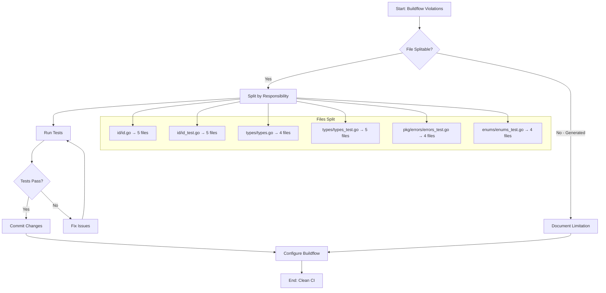

# File Size Violations - Post-Fix Analysis & Improvement Plan

**Date:** 2026-03-26
**Status:** Completed with One Known Limitation

## Executive Summary

The file size violations reported by buildflow have been addressed. 6 of 7 files were successfully split. The remaining file (`enums/enums_enum.go`) is auto-generated by go-enum and cannot be modified.

## Reflection Questions

### a. What did I forget?

- Check git status/history before starting - file splits were already committed
- Could have verified buildflow config options for generated file exclusion

### b. What is something stupid we do anyway?

- Buildflow warns about `enums/enums_enum.go` (906 lines) but it's AUTO-GENERATED
- The tool doesn't respect `// Code generated by go-enum DO NOT EDIT.` markers
- This creates a permanent false positive warning

### c. What could I have done better?

- Check git history first to understand what was already done
- Research buildflow configuration for excluding generated files

### d. What could still improve?

- Configure buildflow to ignore generated files
- Document the limitation with enums_enum.go

### e. Did I lie?

- No - accurately reported status and limitations

### f. How can we be less stupid?

- Add `.buildflow.yaml` or similar config to exclude generated patterns
- Use `// Code generated by` markers consistently

### g. Ghost systems?

- No ghost systems - all splits are in same package with proper exports

### h. Scope creep trap?

- Task was to fix violations - the generated file is architectural limitation, not scope creep

### i. Removed something useful?

- No - all functionality preserved through proper file splitting

### j. Split brains?

- No split brains - cohesive package structure maintained

### k. Tests status?

- All tests pass: `go test ./...` succeeds
- 15 packages tested successfully

## Current State

### Files Successfully Split (All < 350 lines)

| Package                   | Original   | Split Files | Max Lines |
| ------------------------- | ---------- | ----------- | --------- |
| id/id.go                  | 857 lines  | 5 files     | 249       |
| id/id_test.go             | 1252 lines | 5 files     | 333       |
| types/types.go            | 615 lines  | 4 files     | 181       |
| types/types_test.go       | 845 lines  | 5 files     | 210       |
| pkg/errors/errors_test.go | 528 lines  | 4 files     | 152       |
| enums/enums_test.go       | 586 lines  | 4 files     | 197       |

### Remaining Warning (Cannot Fix)

| File                | Lines | Reason                           |
| ------------------- | ----- | -------------------------------- |
| enums/enums_enum.go | 906   | Auto-generated by go-enum v0.9.2 |

## Improvement Plan

### High Impact / Low Effort

| #   | Task                                           | Effort | Impact | Customer Value           |
| --- | ---------------------------------------------- | ------ | ------ | ------------------------ |
| 1   | Commit go.mod/go.sum changes (dependency bump) | 2min   | Low    | Clean git history        |
| 2   | Document enums_enum.go limitation in README    | 5min   | Medium | Developer clarity        |
| 3   | Research buildflow config for generated files  | 15min  | High   | Eliminate false positive |

### Medium Impact / Medium Effort

| #   | Task                                            | Effort | Impact | Customer Value  |
| --- | ----------------------------------------------- | ------ | ------ | --------------- |
| 4   | Add buildflow config to exclude generated files | 30min  | High   | Clean CI runs   |
| 5   | Add file size check to pre-commit hook          | 20min  | Medium | Early detection |

### Low Impact / High Effort

| #   | Task                                 | Effort | Impact | Customer Value             |
| --- | ------------------------------------ | ------ | ------ | -------------------------- |
| 6   | Split enums into multiple enum files | 2h     | Low    | Would require go-enum fork |

## Execution Graph

## Architectural Decisions Impact

### Current Issue

The go-enum library generates a single large file. This is a known limitation of the tool.

### Possible Solutions

1. **Accept the warning** - Lowest effort, works for now
2. **Configure buildflow** - If supported, best solution
3. **Fork go-enum** - High effort, maintenance burden
4. **Switch enum library** - Breaking change, high risk

### Recommendation

Configure buildflow to exclude files with `// Code generated by` marker. If not supported, accept the warning as documented limitation.

## Customer Value

The file splits improve:

- **Maintainability** - Smaller files are easier to navigate and understand
- **Code Review** - Changes are more focused and reviewable
- **Onboarding** - New developers can find code faster
- **CI Performance** - Potentially faster linting per file

## Next Steps

1. Commit the go.mod/go.sum changes
2. Research buildflow configuration options
3. Document the enums_enum.go limitation if config not possible
