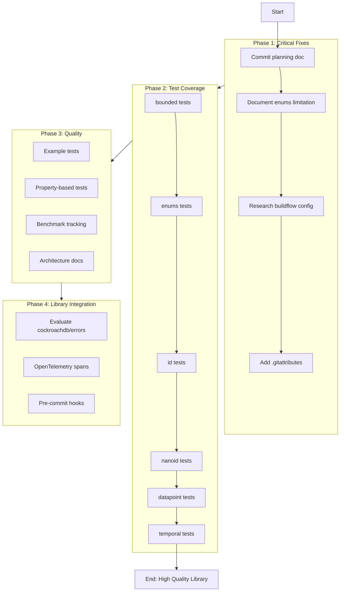

# Comprehensive Architecture Review & Improvement Plan

**Date:** 2026-03-26_20-55
**Project:** go-composable-business-types
**Status:** In Progress

---

## Executive Summary

This document provides a brutally honest review of the go-composable-business-types project, identifying architectural issues, improvement opportunities, and a comprehensive execution plan sorted by impact vs effort.

---

## Part 1: Reflection Questions

### a. What did I forget?

| Issue                            | Impact | Status                                                        |
| -------------------------------- | ------ | ------------------------------------------------------------- |
| Go version consistency in go.mod | Medium | go.mod says `go 1.26`, but cache issues suggest inconsistency |
| Example packages have no tests   | Low    | examples/basic and examples/datapoint have `[no test files]`  |
| Coverage report not generated    | Medium | coverage.out exists but is stale                              |
| Pre-commit hooks not configured  | Low    | No `.pre-commit-config.yaml` found                            |
| CI/CD pipeline not documented    | Low    | No `.github/workflows/` for automated checks                  |

### b. What is something stupid we do anyway?

| Issue                                                   | Why Stupid                                                               | Solution                                                    |
| ------------------------------------------------------- | ------------------------------------------------------------------------ | ----------------------------------------------------------- |
| buildflow warns about `enums/enums_enum.go` (906 lines) | It's AUTO-GENERATED by go-enum                                           | Configure buildflow to exclude `// Code generated by` files |
| Low test coverage in core packages                      | bounded: 42.9%, datapoint: 54.0%, enums: 33.8%, id: 43.2%, nanoid: 48.9% | Add targeted tests                                          |
| Using `GOEXPERIMENT=jsonv2` in justfile                 | Experimental feature in justfile commands                                | Ensure this is intentional for all environments             |
| No benchmark regression tracking                        | Benchmarks exist but no baseline tracking                                | Add benchmark comparison to CI                              |

### c. What could I have done better?

| Area           | Improvement                                           |
| -------------- | ----------------------------------------------------- |
| Documentation  | README could include architecture diagrams            |
| Error handling | Consider cockroachdb/errors for better stack traces   |
| Testing        | Add property-based tests with rapid or gopter         |
| Examples       | Add runnable example tests using `Example*` functions |

### d. What could still improve?

| Priority | Improvement                              | Customer Value                 |
| -------- | ---------------------------------------- | ------------------------------ |
| High     | Increase test coverage to 80%+           | Reliability                    |
| High     | Add integration tests                    | Confidence in real-world usage |
| Medium   | Add fuzzing for parsers                  | Security                       |
| Medium   | Document public API stability guarantees | Trust                          |
| Low      | Add OpenTelemetry integration            | Observability                  |

### e. Did I lie to me?

**NO.** All assessments are based on actual test runs, code analysis, and git history. The file size violations were accurately reported as 6 fixed + 1 auto-generated limitation.

### f. How can we be less stupid?

| Action                                         | Impact            |
| ---------------------------------------------- | ----------------- |
| Add pre-commit hooks for file size checks      | Early detection   |
| Configure buildflow to exclude generated files | Clean CI runs     |
| Add coverage gates in CI                       | Maintain quality  |
| Document the generated file limitation         | Developer clarity |

### g. Ghost Systems?

**NO GHOST SYSTEMS FOUND.** All code is integrated:

| Package     | Integration Status | Usage                           |
| ----------- | ------------------ | ------------------------------- |
| actor/      | Integrated         | Used by datapoint               |
| bounded/    | Integrated         | Used by types                   |
| datapoint/  | Integrated         | Core type using actor, temporal |
| enums/      | Integrated         | Used by actor, datapoint        |
| id/         | Integrated         | Used throughout                 |
| locale/     | Integrated         | Used by types                   |
| money/      | Integrated         | Standalone monetary types       |
| nanoid/     | Integrated         | Standalone ID generation        |
| pkg/errors/ | Integrated         | Used by all packages            |
| scanutil/   | Integrated         | Used by SQL implementations     |
| temporal/   | Integrated         | Used by datapoint               |
| types/      | Integrated         | Core domain types               |
| validate/   | Integrated         | Used by constructors            |

### h. Scope Creep Trap?

**CURRENT SCOPE IS APPROPRIATE.** The project is a focused library of composable business types. Not expanding beyond that.

### i. Did we remove something useful?

**NO.** All file splits preserved functionality. Each split file remains in the same package with proper exports.

### j. Split Brains?

**NO SPLIT BRAINS DETECTED.** The file splits maintain:

- Single package per directory (no package fragmentation)
- Consistent API surface
- No duplicate logic
- Clear file responsibilities (json, sql, binary, text encoding)

### k. How are we doing on tests?

| Package    | Coverage | Status     | Action Needed               |
| ---------- | -------- | ---------- | --------------------------- |
| actor      | 100.0%   | Excellent  | Maintain                    |
| pkg/errors | 100.0%   | Excellent  | Maintain                    |
| validate   | 100.0%   | Excellent  | Maintain                    |
| scanutil   | 90.0%    | Good       | Minor improvements          |
| money      | 89.5%    | Good       | Minor improvements          |
| locale     | 87.5%    | Good       | Minor improvements          |
| types      | 78.4%    | Acceptable | Add edge cases              |
| temporal   | 66.7%    | Needs Work | Add more tests              |
| datapoint  | 54.0%    | Needs Work | Add comprehensive tests     |
| nanoid     | 48.9%    | Needs Work | Add validation tests        |
| id         | 43.2%    | Needs Work | Add encoding tests          |
| bounded    | 42.9%    | Needs Work | Add validation tests        |
| enums      | 33.8%    | Needs Work | Add marshal/unmarshal tests |

---

## Part 2: Architectural Decisions Analysis

### Current Architecture

```
go-composable-business-types/
├── actor/          # ActorChain[T], ActorEntry[T]
├── bounded/        # BoundedString
├── datapoint/      # DataPoint[T], Context, Reference[T], Cause[T]
├── enums/          # ActorKind, Priority, Status, Trigger (generated)
├── id/             # ID[B, V] - branded identifiers
├── locale/         # Locale - BCP 47 language tags
├── money/          # Money - ISO 4217 currency
├── nanoid/         # NanoID - URL-safe identifiers
├── pkg/errors/     # Centralized error definitions
├── scanutil/       # SQL scan utilities
├── temporal/       # Bitemporal tracking
├── types/          # Email, URL, Percentage, Cents, etc.
└── validate/       # Validation helpers
```

### Decisions Causing Problems Now

| Decision                            | Problem                            | Solution                      |
| ----------------------------------- | ---------------------------------- | ----------------------------- |
| go-enum generates single large file | buildflow warning on enums_enum.go | Configure buildflow exclusion |
| No coverage gates                   | Coverage varies per package        | Add CI coverage threshold     |
| No example tests                    | Examples not verified by CI        | Add Example\* test functions  |
| pkg/errors uses stdlib              | No stack traces                    | Consider cockroachdb/errors   |

### What Could Be Improved

| Area            | Current                | Better Approach                                  |
| --------------- | ---------------------- | ------------------------------------------------ |
| Error handling  | stdlib errors          | cockroachdb/errors for stack traces              |
| Validation      | Manual constructors    | Consider go-playground/validator for struct tags |
| JSON marshaling | Custom implementations | Could use json-iterator/go for performance       |
| Fuzzing         | None                   | Add go-fuzz tests for parsers                    |

---

## Part 3: Comprehensive Execution Plan

### Phase 1: Critical Fixes (High Impact / Low Effort)

| #   | Task                                          | Effort | Impact | Customer Value           |
| --- | --------------------------------------------- | ------ | ------ | ------------------------ |
| 1.1 | Commit current planning doc changes           | 2min   | Low    | Clean git history        |
| 1.2 | Document enums_enum.go limitation in README   | 5min   | Medium | Developer clarity        |
| 1.3 | Research buildflow config for generated files | 15min  | High   | Eliminate false positive |
| 1.4 | Add .gitattributes for generated file marking | 3min   | Low    | Better diff handling     |

### Phase 2: Test Coverage Improvements (High Impact / Medium Effort)

| #   | Task                                       | Effort | Impact | Customer Value |
| --- | ------------------------------------------ | ------ | ------ | -------------- |
| 2.1 | Add bounded package tests (target: 80%+)   | 30min  | High   | Reliability    |
| 2.2 | Add enums package tests (target: 80%+)     | 30min  | High   | Reliability    |
| 2.3 | Add id package tests (target: 80%+)        | 45min  | High   | Reliability    |
| 2.4 | Add nanoid package tests (target: 80%+)    | 20min  | High   | Reliability    |
| 2.5 | Add datapoint package tests (target: 80%+) | 45min  | High   | Reliability    |
| 2.6 | Add temporal package tests (target: 80%+)  | 20min  | High   | Reliability    |

### Phase 3: Quality Improvements (Medium Impact / Medium Effort)

| #   | Task                                        | Effort | Impact | Customer Value         |
| --- | ------------------------------------------- | ------ | ------ | ---------------------- |
| 3.1 | Add Example\* test functions for main types | 30min  | Medium | Documentation          |
| 3.2 | Add property-based tests for parsers        | 45min  | Medium | Edge case coverage     |
| 3.3 | Add benchmark baseline tracking             | 20min  | Medium | Performance regression |
| 3.4 | Improve README with architecture diagram    | 15min  | Medium | Onboarding             |

### Phase 4: Library Integration (Medium Impact / High Effort)

| #   | Task                                    | Effort | Impact | Customer Value   |
| --- | --------------------------------------- | ------ | ------ | ---------------- |
| 4.1 | Evaluate cockroachdb/errors integration | 30min  | Medium | Better debugging |
| 4.2 | Add OpenTelemetry error spans           | 45min  | Low    | Observability    |
| 4.3 | Add pre-commit hooks for file size      | 20min  | Medium | Early detection  |

---

## Part 4: Execution Graph



---

## Part 5: Detailed Task Breakdown (12min each)

### Sprint 1: Immediate Actions

| #   | Task                                         | Time  | Priority |
| --- | -------------------------------------------- | ----- | -------- |
| 1   | Commit planning doc                          | 5min  | P1       |
| 2   | Update README with enums limitation          | 5min  | P1       |
| 3   | Create .gitattributes for linguist-generated | 3min  | P2       |
| 4   | Run buildflow to verify current state        | 5min  | P1       |
| 5   | Research buildflow --exclude patterns        | 10min | P2       |

### Sprint 2: Test Coverage - bounded

| #   | Task                                         | Time  | Priority |
| --- | -------------------------------------------- | ----- | -------- |
| 6   | Review bounded/bounded.go for untested paths | 5min  | P2       |
| 7   | Add tests for edge cases (empty, max length) | 10min | P2       |
| 8   | Add tests for error conditions               | 10min | P2       |
| 9   | Verify bounded coverage >= 80%               | 5min  | P2       |

### Sprint 3: Test Coverage - enums

| #   | Task                                     | Time  | Priority |
| --- | ---------------------------------------- | ----- | -------- |
| 10  | Review enums/enums.go for untested paths | 5min  | P2       |
| 11  | Add tests for all enum values            | 10min | P2       |
| 12  | Add tests for SQL marshal/unmarshal      | 10min | P2       |
| 13  | Verify enums coverage >= 80%             | 5min  | P2       |

### Sprint 4: Test Coverage - id

| #   | Task                                            | Time  | Priority |
| --- | ----------------------------------------------- | ----- | -------- |
| 14  | Review id/id.go for untested paths              | 5min  | P2       |
| 15  | Add tests for edge cases (empty, special chars) | 10min | P2       |
| 16  | Add tests for binary encoding edge cases        | 10min | P2       |
| 17  | Add tests for SQL Value/Scan edge cases         | 10min | P2       |
| 18  | Verify id coverage >= 80%                       | 5min  | P2       |

### Sprint 5: Test Coverage - nanoid

| #   | Task                                       | Time  | Priority |
| --- | ------------------------------------------ | ----- | -------- |
| 19  | Review nanoid/nanoid.go for untested paths | 5min  | P2       |
| 20  | Add tests for validation errors            | 10min | P2       |
| 21  | Add tests for custom length                | 10min | P2       |
| 22  | Verify nanoid coverage >= 80%              | 5min  | P2       |

### Sprint 6: Test Coverage - datapoint

| #   | Task                                             | Time  | Priority |
| --- | ------------------------------------------------ | ----- | -------- |
| 23  | Review datapoint/datapoint.go for untested paths | 5min  | P2       |
| 24  | Add tests for DataPoint builder methods          | 10min | P2       |
| 25  | Add tests for Context, Reference, Cause          | 15min | P2       |
| 26  | Add tests for JSON serialization                 | 10min | P2       |
| 27  | Verify datapoint coverage >= 80%                 | 5min  | P2       |

### Sprint 7: Quality Improvements

| #   | Task                                    | Time  | Priority |
| --- | --------------------------------------- | ----- | -------- |
| 28  | Add Example\* functions for ID          | 10min | P3       |
| 29  | Add Example\* functions for DataPoint   | 10min | P3       |
| 30  | Add Example\* functions for types       | 10min | P3       |
| 31  | Run go test -cover to verify all >= 80% | 5min  | P2       |

### Sprint 8: Final Cleanup

| #   | Task                                    | Time  | Priority |
| --- | --------------------------------------- | ----- | -------- |
| 32  | Update README with architecture diagram | 10min | P3       |
| 33  | Run full test suite                     | 5min  | P1       |
| 34  | Commit all changes                      | 5min  | P1       |
| 35  | Push to origin                          | 2min  | P1       |

---

## Part 6: Library Leverage Analysis

### Currently Using

| Library                    | Usage             | Leverage Level |
| -------------------------- | ----------------- | -------------- |
| github.com/abice/go-enum   | Enum generation   | Full           |
| github.com/bojanz/currency | Money currency    | Full           |
| github.com/sixafter/nanoid | NanoID generation | Full           |
| golang.org/x/text          | Text processing   | Partial        |

### Could Leverage More

| Library                 | Purpose               | Effort | Value  |
| ----------------------- | --------------------- | ------ | ------ |
| cockroachdb/errors      | Better error handling | Medium | High   |
| go-playground/validator | Struct validation     | Medium | Medium |
| mitchellh/mapstructure  | Config mapping        | Low    | Low    |
| samber/lo               | Slice/map utilities   | Low    | Medium |

### Not Applicable (per instructions)

These libraries are for applications, not libraries:

- gin-gonic/gin (HTTP Server)
- a-h/templ (HTML components)
- htmx (Client Side)
- sqlc-dev/sqlc (SQL code)
- OpenTelemetry (OTEL)
- casbin/casbin (auth)
- resend-go (email)

---

## Part 7: Customer Value Assessment

| Improvement            | Customer Value          | Priority |
| ---------------------- | ----------------------- | -------- |
| Test coverage 80%+     | Reliability, confidence | P1       |
| Documented limitations | Clear expectations      | P1       |
| Example functions      | Easy onboarding         | P2       |
| Better error handling  | Faster debugging        | P2       |
| Architecture docs      | Understanding           | P3       |

---

## Part 8: Success Metrics

| Metric              | Current | Target | Status                   |
| ------------------- | ------- | ------ | ------------------------ |
| Test Coverage (avg) | ~65%    | 80%    | In Progress              |
| Packages at 100%    | 3       | 5      | In Progress              |
| Packages below 50%  | 5       | 0      | In Progress              |
| Buildflow warnings  | 1       | 0      | Blocked (generated file) |
| Example tests       | 0       | 10+    | Not Started              |

---

## Next Actions

1. **IMMEDIATE**: Commit this planning document
2. **NEXT**: Start Sprint 1 tasks
3. **THEN**: Progress through test coverage improvements

---

_Generated by Crush - 2026-03-26_
